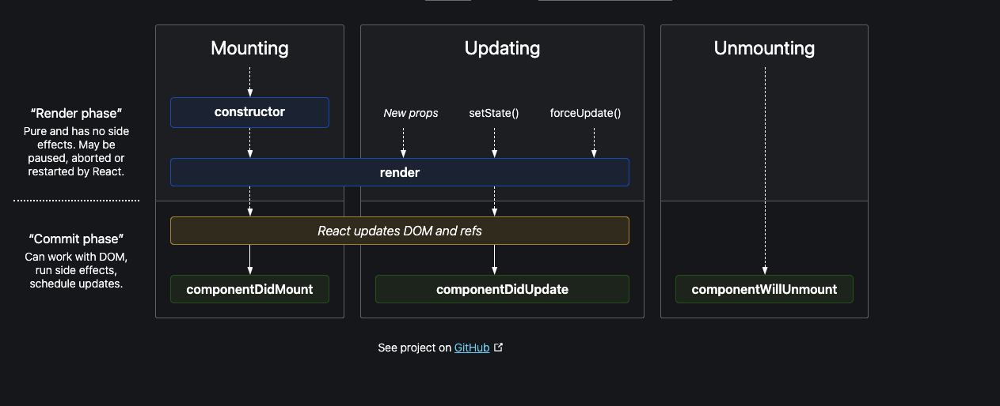

## let's understand the basics 

- previously we saw creating the react element using React.createElement but creating the complex would become very clumsy 
- so in order to get the simpler way to create the react element we have jsx
- jsx is simply writing html like syntax 
- we can write code something like shown below
```js
const element = <h1>this is heading</h1>
```
- creating a element like above is as similar as React.createElement but this above syntax is very easy which is html like syntax ,
- since we are writing it in the js file then , is that a js syntax will js understand that syntax , definetly no then how does js read it and how does browser display these element 
- well the point is , even before the code reaches the browser or js engine it goes through parcel and then it has babel , babel is a javascript compiler which basically converts the jsx to the code which js engine can understand
- so the code you see in line 8 above is converted to React.createElement by babel and then it is rendered , React.createElement just creates an object and then it rendered using root.render (root is created using ReactDOM.createRoot())
- components , we can have functional or class compoents
- when we write one components in another components then that is known as ***component composition***
- jsx also prevent cross site scripting , for example we make an api call and that has some malicious data jsx will remove those code 
- For calling components we can simply use <Title /> or <Title></Title> functional components are nothing but js functions and js function can be called , so can also call these functional components inside a curly braces {Title()}
- funciton that returns react element is functional components

### let's improve the code and create a food app
- lets  first design think about what we are going to develop 
- a nav bar , body with multiple cards 
- a footer 

- checkout the code in app.js 

### why key is required when we are using map 
> - if we dont pass any key then if any new component comes in between then react will not be able to find out which one is new one and thus react will re render the whole component , if you dont pass the key then all the components will be same , and any new component comes react will not be able to identify the new one and thus it will re render the whole component again , but if you give each component a unique id , then react will not re render the whole component , as react will identify the new componet 

### can you use index as key 
> - index as a key is anti pattern , but this is not recommended , use only when you dont have a unique id 

### Project Progress...
> - we first created the created the Header component and restructured it in a seperate folder called component, then similary we created a body component and then res card compoent now inside body compone when we were adding res card then we had used map in order to render multiple res cards 
> - then we created a feature to filter the restaurant with rating more than four , for that we implemented it using the filter on onClick and we update the state of a variable , if we had used a simple variable it wouldn't have updated the rescard , this is the problem react solves, react uses virtual dom in order update dom , so any time state updates react will re render the component so when state changes , react re-render that component 

### why react is so fast , let's understand some very important point , like dom manipluation, how react works behind the scenes 
> - how react work behind the scenes
>> react uses reaconsilation alg. also known as react fiber , for example we have a component and inside that component , it renders muliple Card component then after filteration state updates and only few card are rendered back , how does this happen , hence react creates , so react creates virtual dom for all the cards and the moment state updates , react will check the differences before and after then if there is any changes react will update the UI virtual dom is nothing but react.createElement which is an object similary the component you create (or in simple work html you write is virtual dom) Diff algorigthm will find the differences between the compoenent before and after , after state change, 
> - why is react fast , because it does efficient dom manipulation , react can find differeneces between before and after component , it has diff alg. , it find out the diff and update the UI 
> - for example if we have a simple variable and and on click of a button we change the data of that variable , then we will see the variable data will changes but UI will not be updated , this is the problem which react is solving , it keeps the data and UI binded together or tied together, react as we read in the above line that react is super fast in dom manipulation. So that's why normal js variable won't work , we need to use useState the moment you update react useState method , react will re-run the function or component and that state is new one now , a new instance 
> - another instance when we create a textbox and on change of textbox we are updating state variable which is the value of text input box , so user when types, on every change or every type user type letter then react re-render the whole component and this is done so fast which is because react concilation algorithm it compares between the older one and the newer one. hence when state variable updates, react triggers a reconcillation cycle (re-renders the component)

### React Fiber Architecture
> - [React fiber Architecture](https://github.com/acdlite/react-fiber-architecture)

### UseEffect
> - useEffect without any dependency array it will load everytime the component is rendered , if dependency array is present (and it doesn't have any value inside it) useEffect will be called only on the initial render and if there is dependency state variable included then it will be called every time when dependent state changes

### normal variable vs state variable
> - one may ask why not we use normal variable instead of useState , but when you use you will find out that component will not be updated or rendered when variable data changes , because react will not know whether the variable is changed or not , and in case of useState the moment you use it , react will know whenever the state changes 

### Routing
> - for routing we are using react router dom , this will give us createBrowserRouter, RouterProvider , Outlet (for children rendering) , as you can in side the project how we are handling the routing 

### client side routing and server side routing
> - react router dom provides Link tag to navigate through different routes, using Link tag we can achieve client side routing , what is client side routing and server side routing , server side routing means , when navigate to a page the whole page is coming from the server for example if you use anchor tag inside react code it will load the whole page and fetches all the data from server but where as in client side routing , all the pages are there in the client side, react will only render the specific component

### for creating the dynamic routing
> - for dynamic routing we can simply use path with :id , and this will take us to dynamic page and then we can handle accordingly

### class component 
> we created userclass component, to create a class component , just extend the class with React.Component we will create the constructor as well 
> inside constructor we will add super method this is called in order to call the constructor of the parent class. It is used when we need to access a few variables in the parent class
> - example
>> - let's understand it with example, we have added a class component with name UserClass file inside About page
> - how life cycle of class component will work 
>> - for example if we have one children inside about page then , first parent constructor is called then parent render is called , and then render method updates the DOM , (runs reconcilation alg.) finds out the diff , once dom is updated it will find out there is another child inside it then it will start another life cycle of child component and then child constructor will be called , and then child render method will be called , and after updating the DOM it will call childs' componentDidMount and comes back to parent and then finally parents' ComponentDidMount will be called 
> - how will life cycle work when we have multiple child
>> -  it works almost the same but constructor and render method are batched together for children as , reacts lifecycle work in 2 phase render phase and commit phase , thus child1 constructor and then child1 render and child2 constructor and then child2 render  will be called and the componentDidMount for both the child will be batched together and executed one by one based on the order in which it is called , and finally the parent componentDidMount will be called 
> - what happens after the componentDidMount 
>> - let's understand from the beginning , for example when a page is loading , first constructor is called and then render method is called this is render phase , where dom update happend with the dummy data or default data , after this component did mount is called and if we have any api inside which updates the state and then if state changes then (update cycle will start...) react will again call the render method to update the DOM(commit phase, update happens in commit phase) ,this time dom will be updated with the api data , and the componentDidUpdate is called , and there is one final cycle which is componentWillUnmount this is called when any component is unmounted 
> - why is react batching render and commit phase 
>> - it's because after render , react updates the dom , and uses the reconcilation algorithm to find the difference and this is very expesive task and thus react batches the render and commit phase


### React life cycle method diagram


### let's see the whole react cycle
> - let's see for about.js page , first About component will load , construcutor will be called once contructor is called then render method will be called this is render phase then it goes to commit phase componentDidMount and executes this method. now this is whole process is ***mounting cycle*** (refer the image)
> - now once the componentDidMount was called and the state is updated then react will render the component with the current data, and after this again if state changes which is becasue of componentDidUpdate again the render will happen , this is updating cycle 
> - we also have componentWillUnmount , now this function is called when about page will unmount

### important points
> - if we have any timer or interval , then we should always clean it , or else it will keep running all the time , for example we have setInterval inside componentDidMount and then if we dont clear it then it will keep on running , so to clear it we can do so while unounting componentWillUnmount, similary we need to clear the same inside a functional component as well , when we have a timer inside a useEffect we should clean it by return a callback and can write code to clear it 

### how can we use update something when state changes in class component 
> - we can use componentDidUpdate method with argument prevProps and PrevState

### order of execution of useEffect in parent and child compponet
> - During the execution of the parent component, if a child component needs to be rendered, the parent component’s render is halted. The child component starts rendering and after its (child component’s) rendering is complete, its (child component’s) set of useEffect hooks are processed. After it’s done, parent component’s render is resumed. and then parent's useEffect will be executed 

### useeffect in custom hooks
> - When a custom hook is involved which has a useEffect hook inside it, it follows the execution pattern of the component in which it is being used.The set of useEffect hooks written inside the custom hook are processed after the component it is written in completes rendering. The order of execution depends in the order they’re written inside the component. If the custom hook is called at the start of the component before the component’s set of useEffect hooks, custom hook’s set of useEffect are processed first and vice versa. 

```js
import {useeffect} from 'react'

const useCustomHook = () => {
    console.debug("2.useCustomHook start")
    useEffect(()=>{
        console.debug("5.useCustomHook's useEffect")
    },[])
    console.debug("3.useCustomHook render end")
}

const ComponentUsesCustomHook = () => {
    console.debug("1.ComponentUsesCustomHook starts")
    useCustomHook()
    useEffect(()=>{
        console.log("6.ComponentUsesCustomHook's useEffect")
    },[])
    console.log("4.ComponentUsesCustomHook render end")
    return <h1>hello</h1>
}
```

### when application grows larger in size how can we optimize it 
> - we can optimizde the code using custom hooks to make the code more reusable , maintainable 
> - when our application grows larger in size and we have lots of components inside one page , and we multiple pages inside the application you will see the application making network calls for the file and all the code you will see bundled inside just one file which keeps on growing , and this bundling are done using parcel , now what if we have application and it has different vertical inside it , like in current application if we introduce grocery a seperate page then , assume that it is itself a huge page and then our source file will grow huge then , for this situation we can use something called lazy loading or on demand loading , or chunking , or code splitting react provides lazy method to use and it also provides suspense which can be used as placeholder or fallback when it request for the other page and in the meanwhile we cna show user a loader or something
```js
    const Component = lazy(()=> import('./abc))
```

### useContext 
> - useContext solves the problem of props drilling , for example if we have some data that is being used across the application then in that case , in order to access the data, we always have to pass the data from the parent component thus this is tedious way to keep passing the props , the more simpler way to do is that we can use useContext , we can create it using createContext as shown in below example

### Higher Order Component
> - Higher order function is a function that takes a component as an argument and returns a component 
> - Higher order function are pure function, that doesn't change the input function , it will only enhance the function on top of it 
> - In our application we created a higher order function called PromotedResCard this function accepts a component or function in its argument
> -  when you are creating a component all the component or function should focus only one one task and more than that , not neccessary but recommended this way the code will be more maintainable , reusable and testable

```js
    const UserContext = createContext({
        loggedInUser: "defaultUser"
    })

    export default UserContext
```
> - once we have created a context, in this example we have create a UserContext , to access it we can use useContext hook from react 
```js
    const userCtx = useContext(UserContext)
```
> - this userCtx will have data that we stored while creating the context 
> - we can also pass the context to specific component or to entire component
```js
    <UserContext.Provider value={{loggedInUser}}>
        <Component /> 
    </UserContext.Provider>
```
> - just pass the values of the context inside UserContext.Provider  now this component will have access to the loggedInUser value , similary we can pass the other values as well for example if we need data that when application loads and data is requried by almost all the component then we get the data inside the useEffect and then we can update context 
> - how can we use inside class based components, just use 
```js
    <UserContext.Consumer>
        {(data)=>{console.log(data)}}
    </UserContext.Consumer>
```

### Redux
> - we will be using redux toolkit , which is a package, intended to be the standard way to write Redux logic. It was originally created to help address three common concerns about Redux:
>> - Configuring a Redux store is too complicated
>> - I have to add a lot of packages to get Redux to do anything useful
>> - Redux requires too much boilerplate code
> - Redux store is like a js object which is kept at the global central place so that it can be accessed from anywhere inside the project
> -  entire data is stored in a single object, is it fine storing inside a single object, yes it is kept inside an object in form of slices, so in redux store we have slices , so we can create different slices , like user slice to store user related informations, cart slice to store cart related informations
> - let's say we want to update the cart item or cart slice by clicking on the add button, to do this when we click on add button , it will dispatch an action, and then it calls a function which is going to update the cart slice , so on click of the add button it dispatches an action and calls the reducer function which will eventually update the slice of our redux store
> - above point is about how we update the store , now how can we read the store , which can be done using selector, selector will read the data from cart slice and selector is going to update the component. to read the cart slice using the selector we subscribe to the store, how do we subscribe -> we do it using selector
> - let's install @reduxjs/oolkit and react-redux

### implementation
> - first we need to create a store for our application, we will create store using configureStore from @reduxjs/toolkit as this has nothing to do with react thus it is coming from library reduxjs/toolkit
```js
    const store = configureStore({})
```
> - once we create the store , we need to create the slices inside the store , so to create the slice we will use createSlice from @reduxjs/toolkit
```js
const cartSlice = createSlice({
    name: "cart",
    initialState: {
        item: []
    },
    reducers: {
        addItem: (state, action) =>{
            state.item.push(action.payload)
        },

        removeItem: (state, action) => {
            state.item.pop()
        },

        clearCart: (state)=> {
            state.item.length = 0
        }
    }
})
```
> - above code is for creating the slice , which takes an object with the given field name, initialState, reducers (function which will be called upon dispatch)
> - and then we will add this slice to our store 
```js
const store = configureStore({
    reducer: {
        cart: cartSlice
    }
})
``` 
> - you see we have reducer and reducers in configureStore and createSlice this indicates reducers will take the muliple reducers function to , whereas reducer in configureStore is for configuring muliple small reducer inside store
> -  now we need to connect this store into our application by wrapping up our application with Provider and it takes store as props <Provider store={store}></Provider>
> - now to read the data from store we need to subscribe to the respective store, to subscribe we will use a hook called useSelector provided by react-redux 
```js
const cartItem = useSelector((store)=> store.cart.item)
```
> -  it is important to note that subscribe to only part that is required by a particular component , which makes the application efficient
> - Previous version of redux didn't allows us to directly mutate the state as we are doing above 
```js 
state.item.push(action.payload)
```
> -  we use to create the newState and return the new updated state, but now the latest version of redux allows to mutate the state
> - for example while deleting we are making length as 0 but what if we try below code to clearCart
```js
    state = []
```
> - it's because while doing this above , inside a function it will create a local variable which will pointing to empty array but once function is executed, the main array is still redirecting to the previous data
> - thus we will try to make the length as 0
